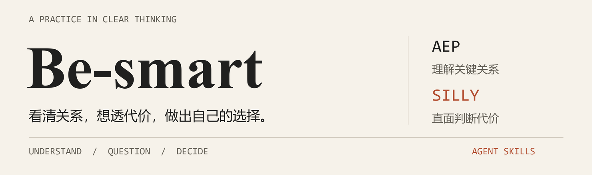

<p align="center">
  
</p>

<p align="center">
  <strong>理解关键关系 · 检验自己的判断 · 提高现实选择的质量</strong>
</p>

<p align="center">
  <a href="#两个入口">认识技能</a> ·
  <a href="#开始使用">开始使用</a> ·
  <a href="docs/philosophy.md">项目理念</a> ·
  <a href="docs/skill-design.md">设计原则</a> ·
  <a href="LICENSE">MIT License</a>
</p>

---

很多时候，我们已经知道不少道理，却没有把决定结果的关系想清楚。知识散落在各处，理由听起来顺畅，真正的代价藏在后面。

**Be-smart 把理解与判断的方法整理成可复用的 Agent Skills 和文档。** 从解释一个概念，到审视一次投入，再到拆开一个让人难以拒绝的要求，让模型围绕关键关系组织知识，帮助你形成自己的判断。

## 两个入口

| | **AEP · 理解关键关系** | **Silly · 把判断和代价说透** |
|---|---|---|
| 你遇到的问题 | 听懂了词，仍不理解原因、条件或推导 | 理由很充分，却可能漏算了代价、激励或退出条件 |
| 它着重处理 | 从已有认识进入问题，解释关系、核对依据、帮助迁移 | 长期资源配置、风险边界、心理机制、竞争与合作 |
| 表达方式 | 准确、连贯、具体，按问题需要选择深度 | 直白、锋利，逐层推进现实代价，使用有依据的反讽 |
| 配合方式 | 可以独立使用 | 自动读取并应用 AEP，合成一份连贯回答 |
| 入口文件 | [skills/aep/SKILL.md](skills/aep/SKILL.md) | [skills/silly/SKILL.md](skills/silly/SKILL.md) |

### AEP：把“听过”推进到“会判断”

```text
使用 aep 帮我理解：为什么提高带宽，不一定能让网页更快打开？
我知道带宽和延迟的定义，但还不明白它们怎样影响实际等待。
```

AEP 会围绕同一个实际过程解释对象、条件与因果，让你能判断条件变化后会发生什么。证明、代码、社会现象和文章分析，按各自需要展开；篇幅服从问题。

[查看理解与迁移示例 →](examples/understanding.md)

### Silly：把一直回避的后果推到眼前

```text
使用 silly 分析：我月薪三千，对方反复找我要一千。
我负担很重，但怕拒绝影响关系，总想着以后赚得更多就好了。
```

下面是原创文风示意：

> 一千块，对他是开口要来的，对你是上班挣来的。你付出去以后，要少买什么、推迟什么、遇到急事拿什么顶，这些全由你承担。
>
> 你每次勉强答应，对方看见的都可能是：这件事还能继续。你的压力藏得越好，他越容易把要求当成正常。你倒替他省下了体谅你的麻烦。
>
> 先把你的上限说清楚，看看他能不能接受。你的难处，在这段关系里总该算数。

它会检验目标、前提、激励与真实替代方案，直接指出关键缺口，再提出能改变局面的动作。已经想清楚代价、负担可承受的价值选择，应得到尊重。

[查看决策分析示例 →](examples/decision-analysis.md) · [阅读完整文风样稿 →](skills/silly/references/voice-and-examples.md)

## 开始使用

需要 Git 和 Python 3.9+。安装脚本只使用 Python 标准库。

先把仓库克隆到普通工作目录：

```sh
git clone https://github.com/chow651/Be-smart.git
cd Be-smart
```

| 客户端 | 安装两个技能 | 默认目标目录 |
|---|---|---|
| Codex | `python scripts/install.py --client codex` | `~/.agents/skills/` |
| Claude Code | `python scripts/install.py --client claude` | `~/.claude/skills/` |

部分系统的 Python 3 命令是 `python3`，相应替换上面的 `python`。安装后，在客户端重新加载技能或开启新会话。

| 想做什么 | Codex | Claude Code |
|---|---|---|
| 使用 AEP | `$aep 帮我理解这个问题……` | `/aep 帮我理解这个问题……` |
| 使用 Silly | `$silly 拆解我这个决定……` | `/silly 拆解我这个决定……` |

AEP 独立使用时保留显式调用方式；Silly 可以由适用请求触发，也会自动读取相邻目录里的 AEP。技能加载最终由客户端执行，安装验证不等于实际回复质量评测。

<details>
<summary><strong>只安装 AEP、指定目录，以及更新已有版本</strong></summary>

只安装 AEP：

```sh
python scripts/install.py --client codex --skill aep
```

选择 Silly 时，安装器会自动带上 AEP：

```sh
python scripts/install.py --client codex --skill silly
```

预览安装范围：

```sh
python scripts/install.py --client codex --dry-run
```

已有同名技能时，安装器会停止。确认需要更新后，使用 `--replace`，旧目录会移到技能扫描目录之外的 `be-smart-backups/`，安装结果会打印准确位置：

```sh
python scripts/install.py --client codex --replace
```

如果你已在其他目录维护这两个技能，用 `--target` 指向原目录，避免产生两套同名入口。例如：

```sh
python scripts/install.py --client codex --target "~/.codex/skills" --replace
```

复制过程中出错会回退本次已安装的目录，恢复原有两个技能。自定义客户端可以将 `skills/aep/` 与 `skills/silly/` 复制到其支持的同一个技能父目录，保留文件结构；两者之间的相对引用需要保持成立。

安装路径与调用选项参考 [OpenAI 官方技能文档](https://learn.chatgpt.com/docs/build-skills) 和 [Claude Code 官方技能文档](https://code.claude.com/docs/en/skills)。

</details>

## 我们怎样理解“更聪明”

**理解。** 能解释决定结果的关系，也能在条件变化时继续判断。

**选择。** 明确自己重视什么，将一项方案与真实可行的替代方案比较。

**纠错。** 识别理解边界，为判断错误留出恢复空间，主动寻找会改变结论的证据。

**行动。** 看清谁获益、谁承担后果，改变关键条件，让能力与可靠合作长期积累。

思想来源包括芒格、巴菲特的资源配置与误判思维，以及心理、社会学习和群体行为研究。HowToLiveBetter 的成本意识与防损意识提供参考。具体迁移和取舍属于本项目的设计判断。

[阅读项目理念 →](docs/philosophy.md) · [追溯 Silly 的思想来源 →](skills/silly/references/principles-and-origins.md)

## 项目结构

```text
Be-smart/
├── skills/
│   ├── aep/                 理解、解释与知识迁移
│   ├── silly/               判断链、现实代价与利益博弈
│   └── manifest.json        安装依赖与调用策略
├── docs/                    项目理念与技能设计原则
├── examples/                原创用法与行为边界示例
├── scripts/                 安装与结构验证
├── tests/                   安装、备份和失败回退测试
└── assets/                  README 视觉素材
```

未来会按实际需要加入理解、认知与决策质量相关的技能和文章。每个技能保持明确职责，文档承担更深入的论证与讨论。

## 维护与验证

```sh
python -m pip install -r requirements-dev.txt
python scripts/check.py
python -m unittest discover -s tests -v
```

检查覆盖技能元数据、本地引用、依赖关系和安装行为。GitHub Actions 在 Windows 与 Linux 上运行同一套检查。对模型行为的判断需要真实问题、对照与反馈；当前示例是人工编写的说明，不作为效果证明。

## 从 jiucai 迁移

本项目接替 [jiucai-skill](https://github.com/chow651/jiucai-skill)。旧项目保留历史，三个旧入口的有用能力已合并到 Silly，可以通过自然语言提出完整分析、集中挑战或会话模式总结。

**MIT License** · 技能与文档持续迭代，欢迎带具体问题、失败样例和改进理由来讨论。
